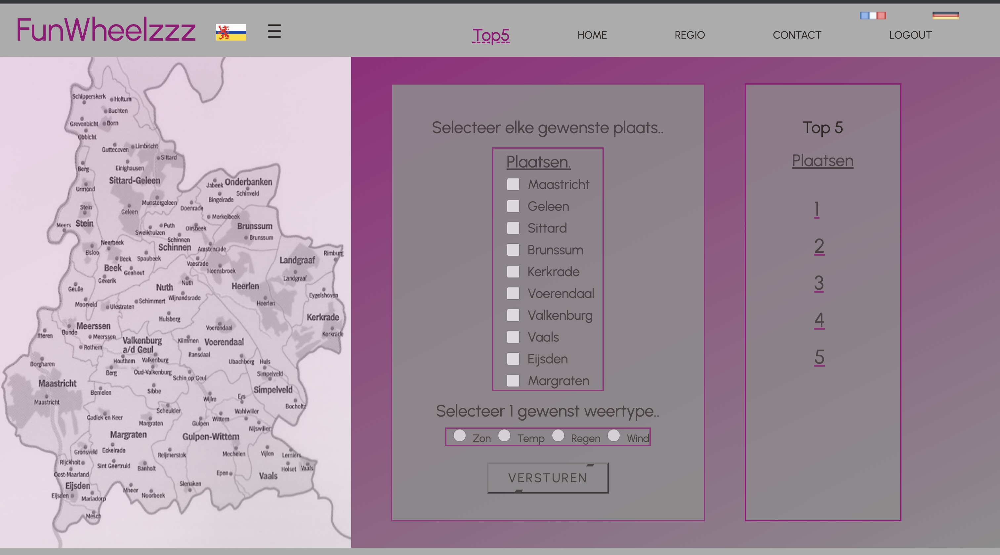

# FunWheelzzz

## introduction

FunWheelzzz is a React project that provides information about the Zuid-Limburg region in
the Netherlands. It's designed for cyclists who are either looking for places to cycle
or tourists who want to explore the region by bike.
The app includes information about hotels, restaurants, events, shops, technical help for
bikes, and other points of interest, all accompanied by beautiful pictures.

### Features
Register and login page to get acces to the website.
Home page containing beautiful pictures of the region's landmarks and attractions.
Region page about hotels, restaurants, events, shops, and bike-related services.
Contact page for users to ask questions or provide tips.

### main Feature
Top 5 weather application that shows the weather of ten different places that people
can visit.
The weather can be chosen based on sun, rain, temperature, and wind.
A top 5 list is created out of those places where it is best to go based on the data.

##### Installation

To install and run FunWheelzzz locally, follow these steps:

Clone the repository: git clone https://github.com/your-username/funwheelzzz.git

Install dependencies: npm install

react
react-dom
react-router-dom
react-scripts
axios
jwt-decode

Install dev-dependencies:

dot.env
parcel

#### Scripts
The following scripts are available for use:

npm start: Starts the development server

#### Api documentation

This application is in need for an API URL and API key from

1. openWeater.org
2. frontend-educational-backend.herokuapp.com

to make the Top5 feature work and to register and login.

#### Usage

To use FunWheelzzz, simply navigate to the app's homepage register and login.
Start exploring the region to find hotels, restaurants, events, shops, and
bike-related services in the region.
Use the top 5 weather feature to find the best places to visit based on the 
weather conditions.

#### file structure

|FunWheelzzz/
|-parcel-cache
|-node-modules
|-public
|-src/
| --assets
| --components/
|   --button
|   --checkbox
|   --footer
|   --hamburger button
|   --inputFieldTop5
|   --nav
|   --radiobutton
| --context
| --pages/
|   --contact
|   --home
|   --login
|   --not found
|   --privacy statement
|   --region
|   --register
|   --top5
| --styles
| --App.js
| --Index.js
.env
.gitignore
package.json
package-lock.json
README.md
External Libraries/
| -node.js Core
| -Project@types/*

#### Contributing
Contributions to FunWheelzzz are always welcome. To contribute, please submit a bug report or a pull request to the project's repository.

#### Contact Information
If you have any questions or comments about FunWheelzzz, please contact the project maintainers at [rjmwrt@gmail.com].

